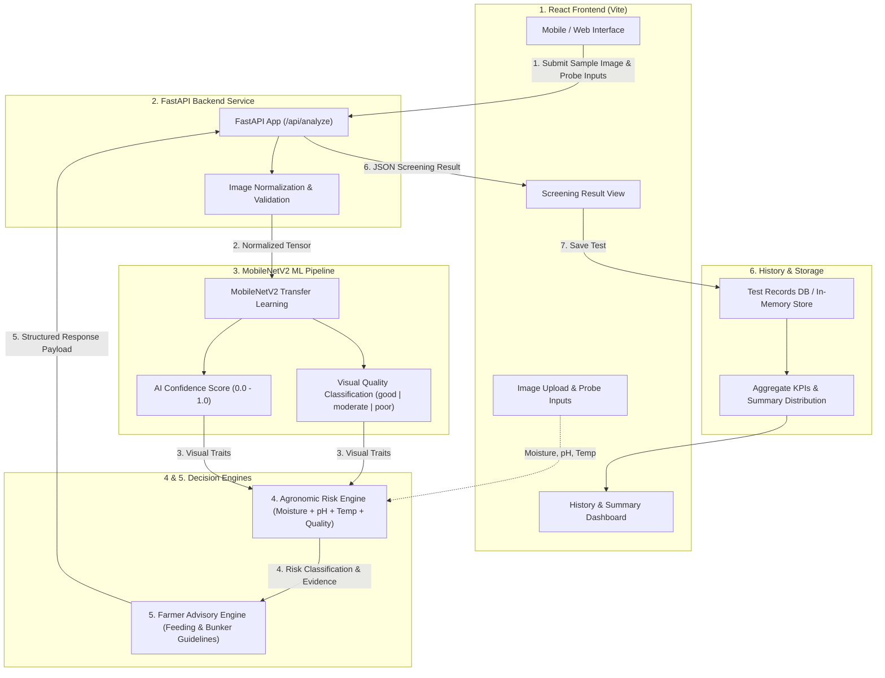

# FeedCheck AI System Architecture

FeedCheck AI is a multi-tier, farmer-oriented feed and silage quality screening system. It couples edge/mobile-friendly computer vision with multi-parameter agronomic risk modeling.

---

## 🏗️ High-Level System Architecture

---

## 🧩 Architectural Component Roles

### 1. React Frontend (`frontend/`)
- **Role**: Client interface optimized for mobile/field usability.
- **Responsibilities**:
  - Captures daylight sample photos and manual probe readings (moisture %, pH level, internal core temperature °C).
  - Dispatches multipart form data to FastAPI (`POST /api/analyze`).
  - Presents screening results: Quality Index gauge (0-100), AI confidence percentage, visual indicators, agronomic evidence, and farmer advisories.
  - Zero predictive logic in React; strictly handles input collection and response rendering.

### 2. FastAPI Backend (`backend/`)
- **Role**: Asynchronous REST API orchestration layer.
- **Responsibilities**:
  - Receives uploaded images and field measurements.
  - Coordinates image preprocessing, passes tensors to the ML model, and pipes predictions through the Risk and Advisory engines.
  - Manages test persistence and history summary endpoints.

### 3. MobileNetV2 Machine Learning Model (`ml/`)
- **Role**: Lightweight visual quality classifier using transfer learning.
- **Responsibilities**:
  - Takes 224×224 RGB feed/silage images.
  - Classifies sample into 3 visual quality tiers:
    - `good`: Optimal preservation, healthy green/yellow pigmentation, clean texture.
    - `moderate`: Acceptable preservation, slight discoloration, minor aerobic warming traits.
    - `poor`: Visible mold sporulation, dark discoloration, slime, or severe moisture pooling.
  - Outputs predicted class and confidence probability (e.g., `0.87`).

### 4. Agronomic Risk Engine (`backend/app/services/risk_engine.py`)
- **Role**: Multi-parameter scientific risk evaluation.
- **Responsibilities**:
  - Evaluates fermentation stability by correlating chemical probe numbers (pH, moisture %) and thermal metrics (core temperature) with computer vision outputs.
  - Flags secondary clostridial/butyric fermentation risk, aerobic heating, or uncompacted dry matter losses.
  - Produces transparent "Why?" evidence points for farmer transparency.

### 5. Advisory Engine (`backend/app/services/advisory.py`)
- **Role**: Practical, herd-safe management guidance.
- **Responsibilities**:
  - Translates technical risk levels into actionable dairy/beef feeding limits (e.g. inclusion limits for lactating cows vs. dry cows/heifers).
  - Recommends bunker face management practices (e.g. daily face removal depth, plastic wrap inspection).

### 6. History & Summary Layer (`backend/app/routes/history.py`)
- **Role**: Longitudinal farm screening records.
- **Responsibilities**:
  - Archives individual batch screening tests.
  - Aggregates seasonal trends: average moisture %, average pH, and quality grade distribution proportions (Grade A / B / C percentages).
